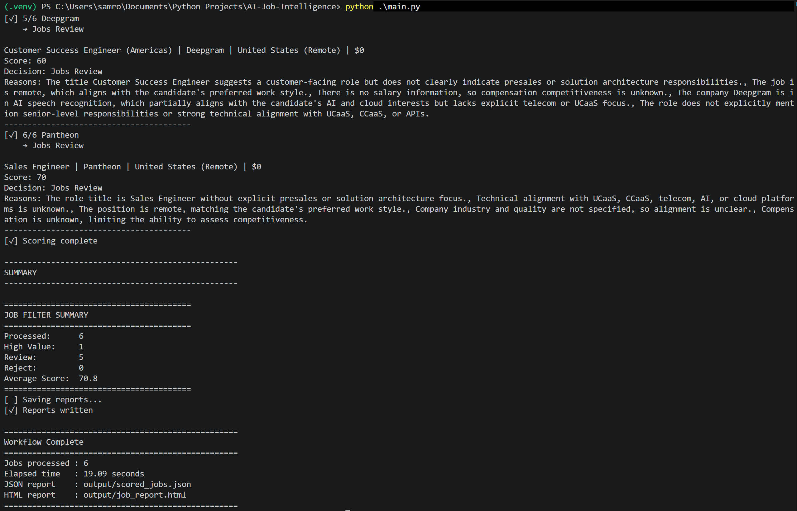
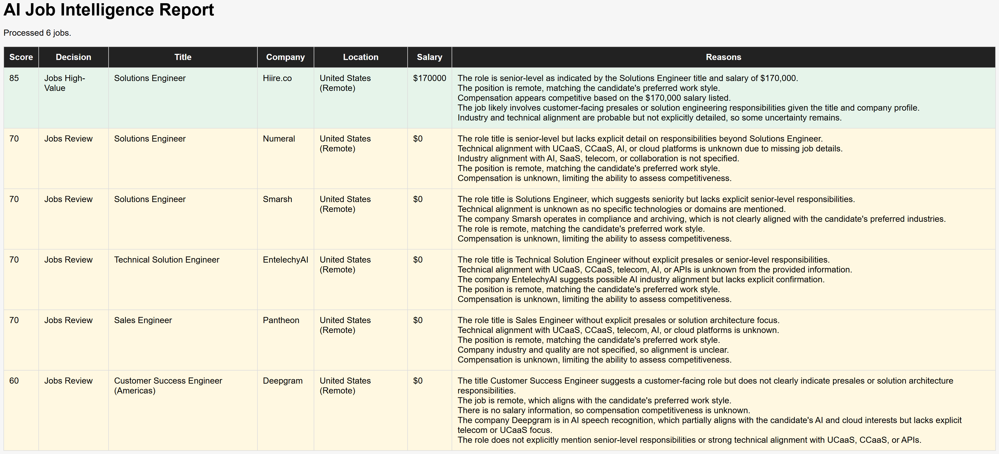
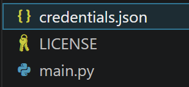

# AI Job Intelligence

An AI-powered job intelligence pipeline that automatically reads LinkedIn Job Alerts from Gmail, evaluates each opportunity with OpenAI, and generates actionable reports.


## Why This Exists

During my job search I found myself spending more time sorting through LinkedIn Job Alert emails than actually applying for positions.

Keyword filtering wasn't enough. Job titles are inconsistent, salary information is often missing, and determining whether a role is actually a good fit still required opening every posting.

Rather than continue doing that manually, I built a pipeline that performs the first pass for me.

The application reads job alerts directly from Gmail, extracts structured information from the HTML, evaluates each opportunity against a customizable candidate profile using an LLM, and generates reports explaining why each position is worth pursuing, reviewing, or rejecting.

## Features

- **Gmail API Integration**
- **OAuth2 Authentication**
- **BeautifulSoup HTML Parsing**
- **OpenAI Job Evaluation**
- **Interactive HTML Dashboard**
- **Prompt-Driven Scoring**

## Demo

**Console**




**Dashboard**



## Workflow
```bash
LinkedIn Job Alerts
          │
          ▼
      Gmail API
          │
          ▼
   HTML Extraction
          │
          ▼
    BeautifulSoup
          │
          ▼
 Structured Job Objects
          │
          ▼
 Duplicate Detection
          │
          ▼
     OpenAI Scoring
          │
          ▼
   Decision Engine
          │
     ┌────┴────┐
     ▼         ▼
 JSON      HTML Report
 ```

## AI Evaluation

Each opportunity is evaluated using an OpenAI model.

The model considers things such as:

- Technical alignment
- Seniority
- Remote preference
- Industry
- Compensation (when available)
- Overall relevance

The response is returned as structured JSON.

```bash
{
    "score": 88,
    "decision": "High Value",
    "summary": "...",
    "reasons": [
        "...",
        "...",
        "..."
    ]
}
```

## Architecture

The project intentionally separates:

**Python**

Responsible for:

- Authentication
- Parsing
- Data processing
- Reporting
- Workflow

**Prompt**

Responsible for:

- Candidate profile
- Business logic
- Scoring behavior
- Decision reasoning

This keeps the application reusable while allowing the evaluation criteria to evolve without changing the underlying code.

## Technologies

-   Python
-   OpenAI API
-   Gmail API
-   BeautifulSoup4
-   OAuth2
-   HTML/CSS
-   JSON

## Installation

``` bash
git clone https://github.com/samrobinsonsd/ai-job-intelligence.git

cd ai-job-intelligence

python -m venv .venv

# Windows

.venv\Scripts\activate

pip install -r requirements.txt

```

Create a `.env` and place your OpenAI API key there, example below:

``` text
OPENAI_API_KEY=your_openai_api_key
```

Place your Gmail OAuth `credentials.json` in the project root.



## Customize for Your Career

One of the goals of this project was to avoid hardcoding career logic into Python.

Everything that determines what makes a good job lives inside a single prompt.

Edit: `prompts/job_scoring.txt`

The scoring prompt can be modified to evaluate opportunities against your own experience, technical background, and career goals.

Update the evaluation prompt in the prompt configuration file with information relevant to your background.

Consider including:

- Current and previous roles
- Technical skills and platforms
- Industry experience
- Preferred job functions
- Target roles
- Seniority level
- Technologies or domains you want to prioritize
- Roles or industries you want to avoid

The application uses this context to score and classify each opportunity as:

- `HIGH_VALUE`
- `REVIEW`
- `REJECT`

More detailed and specific background information generally produces more relevant scoring results.

## Usage

Run the application from the project root:
```bash
python main.py
```
The application will:

1. Authenticate with Gmail
2. Retrieve LinkedIn Job Alert emails
3. Extract job listings from the email HTML
4. Remove duplicate opportunities
5. Evaluate each job using the configured OpenAI prompt
6. Score and classify each opportunity
7. Apply Gmail labels and archive rejected jobs
8. Generate JSON and HTML reports

### Adjusting the Number of Emails Processed

The number of Gmail messages processed per run is controlled in `main.py`.

Find:
```bash
jobs = load_jobs_from_gmail(
    query="label:Jobs",
    max_results=1
)
``` 

Change `max_results` to the number of Job Alert emails you want to process:

```bash
jobs = load_jobs_from_gmail(
    query="label:Jobs",
    max_results=10
)
```
`max_results` controls the number of Gmail messages retrieved, not the total number of jobs.

A single LinkedIn Job Alert email may contain multiple job listings. For example, processing 10 emails may produce 40 or more jobs before or after deduplication depending on the contents of the alerts.

## Roadmap

- Gmail label automation
- Automatic email archiving
- Resume embedding
- Semantic job matching
- Company enrichment
- RAG-powered company research
- Multi-job board support
- Recruiter quality scoring
- Docker deployment
- Historical analytics dashboard

## Why I Built This

This project started as a way to reduce the repetitive work involved in searching for jobs.

It ended up becoming a practical way to learn API integration, prompt engineering, HTML parsing, structured data processing, workflow design, and Python application architecture by solving a real problem instead of building another tutorial project.

## License

MIT License